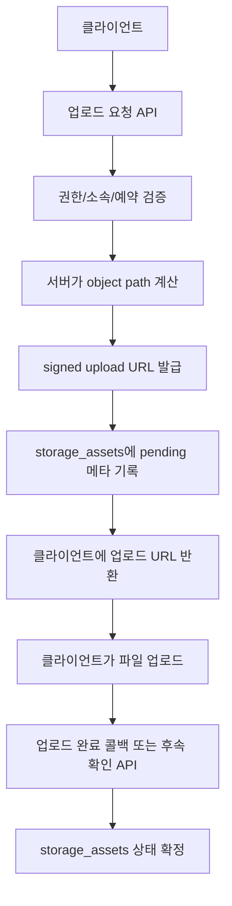

# Beeliber Supabase Signed Upload 설계 초안

## 문서 목적

이 문서는 `ops-private`, `customer-private`, `backoffice-private` 같은 비공개 버킷에서
어떻게 signed upload URL 기반 업로드를 설계할지 정리한 초안이다.

핵심은 간단하다.

- 경로는 서버가 계산
- 업로드 권한은 서버가 검증
- 업로드 후 메타는 DB에 기록

클라이언트가 마음대로 경로를 만들게 두면 그건 좀 아니지 않아요?

---

## 1. 왜 signed upload로 가야 하나

private 버킷은 그냥 프론트에서 경로 문자열 던져서 올리기 시작하면
아래 문제가 생긴다.

- 다른 지점 경로로 업로드 시도 가능
- 예약과 상관없는 파일 업로드 가능
- 파일명 규칙 깨짐
- 메타 테이블 `storage_assets`와 불일치

그래서 private 버킷은 기본적으로
**서버가 signed upload URL을 발급**하고,
클라이언트는 그 URL로만 업로드하는 구조가 맞다.

---

## 2. 권장 흐름



---

## 3. 서버가 받아야 할 입력

### 공통 입력

- `bucket_kind`
- `entity_type`
- `entity_id`
- `content_type`
- `file_extension`

### 운영 증빙(`ops-private`) 추가 입력

- `service_type`
- `event_type`
- `branch_code`
- `booking_id`
- `bag_id`

### 고객 파일(`customer-private`) 추가 입력

- `customer_id`
- `topic`

### 백오피스(`backoffice-private`) 추가 입력

- `domain`
- `branch_code` 선택값

---

## 4. 서버가 해야 할 검증

### 공통

- 로그인 사용자 존재
- 역할 확인
- 허용 MIME 타입 확인
- 허용 확장자 확인

### `ops-private`

- 해당 사용자가 그 `branch_code`에 접근 가능한지
- `booking_id`가 실제 존재하는지
- `booking_id`가 그 지점과 연결되는지
- `event_type`이 허용 목록인지

### `customer-private`

- 현재 로그인 사용자가 그 `customer_id`의 소유자인지

### `backoffice-private`

- 관리자 또는 허용된 내부 직원인지
- 필요한 경우 `branch_code` 메타가 실제 지점과 연결되는지

---

## 5. object path 생성 규칙

### `ops-private`

```text
{service_type}/{event_type}/{yyyy}/{mm}/{branch_code}/{booking_id}/{bag_id}/{uuid}.{ext}
```

예:

```text
delivery/pickup/2026/03/MSIS/booking-uuid/bag-01/asset-uuid.jpg
```

### `customer-private`

```text
{customer_id}/{topic}/{yyyy}/{mm}/{uuid}.{ext}
```

### `backoffice-private`

```text
{domain}/{yyyy}/{mm}/{entity_id}/{uuid}.{ext}
```

중요:

- 파일명은 서버가 `uuid`로 만든다
- 원본 파일명은 메타에만 저장하고 object path에는 넣지 않는 게 안전하다

---

## 6. `storage_assets`에 남겨야 할 메타

최소 권장 컬럼:

- `bucket_id`
- `object_path`
- `entity_type`
- `entity_id`
- `branch_id`
- `uploaded_by_user_id`
- `metadata`

`metadata` 안 추천 키:

- `original_filename`
- `content_type`
- `file_size`
- `upload_status`
- `booking_id`
- `bag_id`
- `event_type`

---

## 7. 권장 API 분리

### 1) signed upload URL 발급 API

역할:

- 입력 검증
- 권한 검증
- object path 생성
- signed upload URL 생성
- `storage_assets` pending row 생성

현재 로컬 초안 파일:

- [SUPABASE_SIGNED_UPLOAD_ENDPOINT_DRAFT.md](/Users/cm/Desktop/beeliber/beeliber-main/docs/SUPABASE_SIGNED_UPLOAD_ENDPOINT_DRAFT.md)
- [signedUploadService.js](/Users/cm/Desktop/beeliber/beeliber-main/functions/src/domains/storage/signedUploadService.js)

### 2) 업로드 완료 확인 API

역할:

- 업로드된 object 존재 확인
- 메타 확정
- 후속 이벤트 발생

예:

- 배송 완료 사진 업로드 후 `job_events` 기록
- 예약 상태 변경과 연결

---

## 8. public 버킷은 어떻게 할 건가

`brand-public`, `branch-public`은 꼭 signed upload가 아니어도 된다.

하지만 실무적으로는 아래 둘 중 하나로 통일하는 게 좋다.

### 옵션 A. public도 서버 발급 경로 사용

장점:

- 경로 규칙이 일관됨
- 클라이언트가 경로를 임의 생성하지 못함

### 옵션 B. public은 인증 클라이언트 직접 업로드

장점:

- 구현이 단순함

단점:

- 파일명/폴더 규칙이 흐트러질 가능성이 큼

Beeliber는 운영 문서 일관성이 중요해서
**옵션 A가 더 안전**하다.

---

## 9. 현재 코드 전환 우선순위

현재 업로드 지점:

- `AdminDashboard > hero`
- `AdminDashboard > locations`
- `AdminDashboard > notices`

권장 순서:

1. `hero` -> `brand-public`
2. `locations` -> `branch-public`
3. `notices` -> `backoffice-private`
4. 예약 증빙 -> `ops-private`

---

## 10. 구현 시 하지 말아야 할 것

- 클라이언트에서 서비스 키 사용
- private 버킷 object path를 클라이언트가 직접 결정
- 업로드 성공 전에 `storage_assets` 확정 처리
- 같은 object path 덮어쓰기 전제 운영

---

## 11. 다음 코드 작업 때 바로 필요한 것

다음 실제 구현 턴에는 아래가 필요하다.

1. signed upload URL 발급용 서버 엔드포인트 선택
2. `storage_assets` 최종 스키마 확정
3. `AdminDashboard` 업로드 함수 공통화
4. Firebase `StorageService.uploadFile()` 대체 어댑터 설계

---

## 12. 이번에 로컬 코드에 깔아둔 준비물

프론트 로컬 준비 파일:

- [supabaseStorageUploadService.ts](/Users/cm/Desktop/beeliber/beeliber-main/client/services/supabaseStorageUploadService.ts)

추가된 env:

- `VITE_STORAGE_UPLOAD_PROVIDER`
- `VITE_SUPABASE_STORAGE_SIGNED_UPLOAD_ENDPOINT`

기본값:

- 여전히 `firebase`
- 즉, 이 파일은 아직 실운영 동작을 바꾸지 않고 다음 단계 구현을 위한 어댑터 역할만 한다
